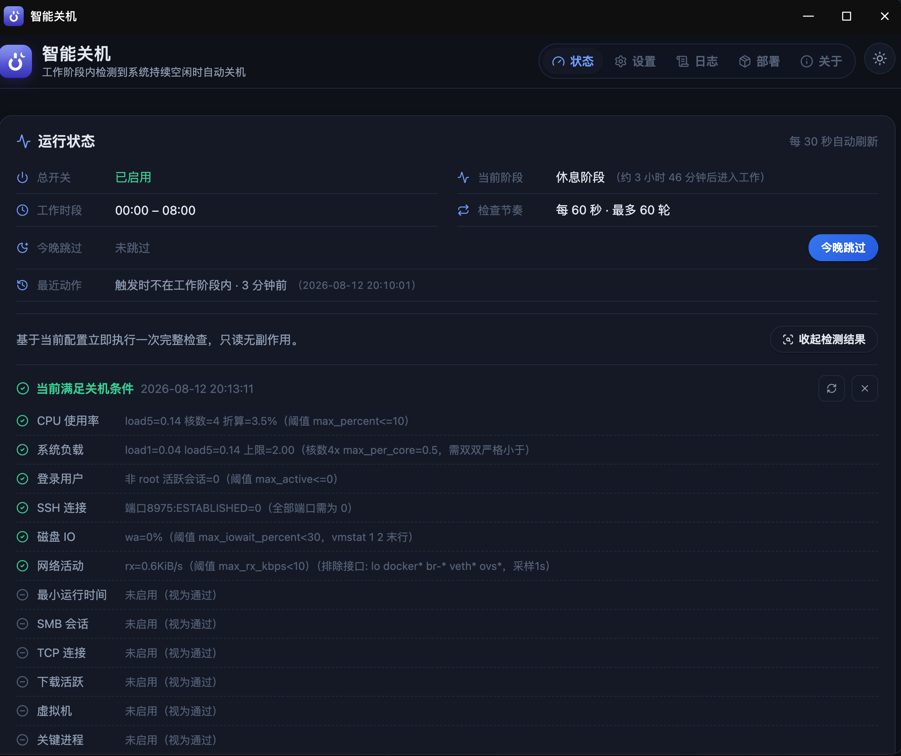
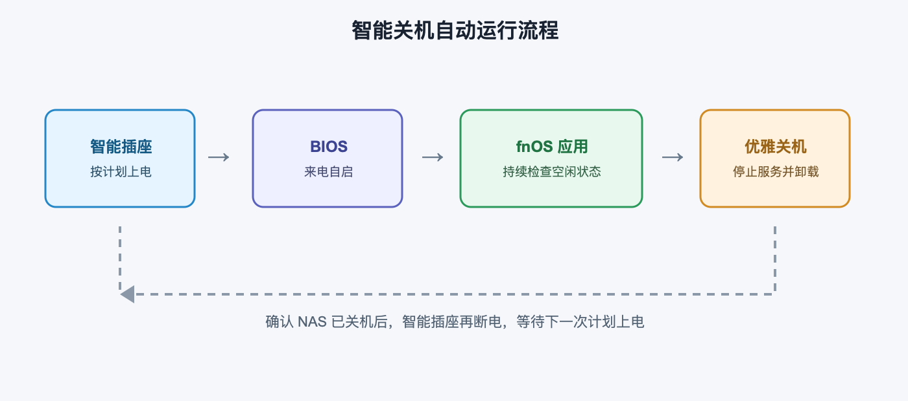
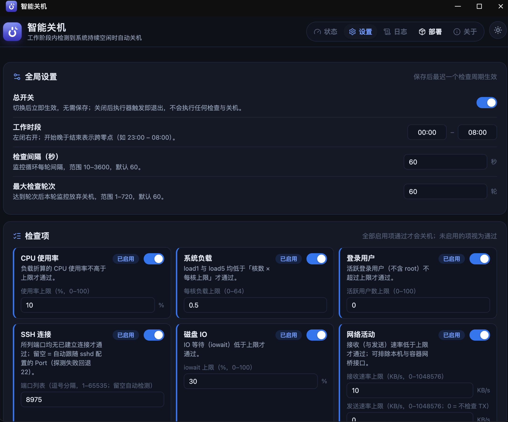
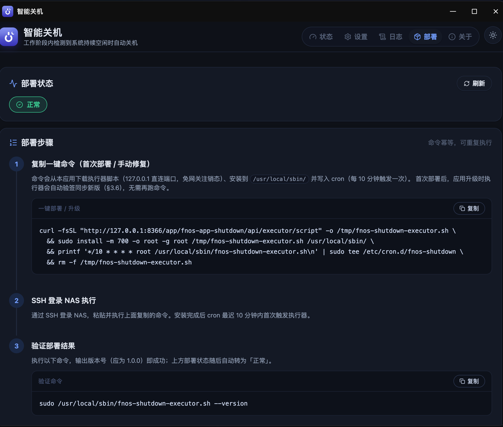
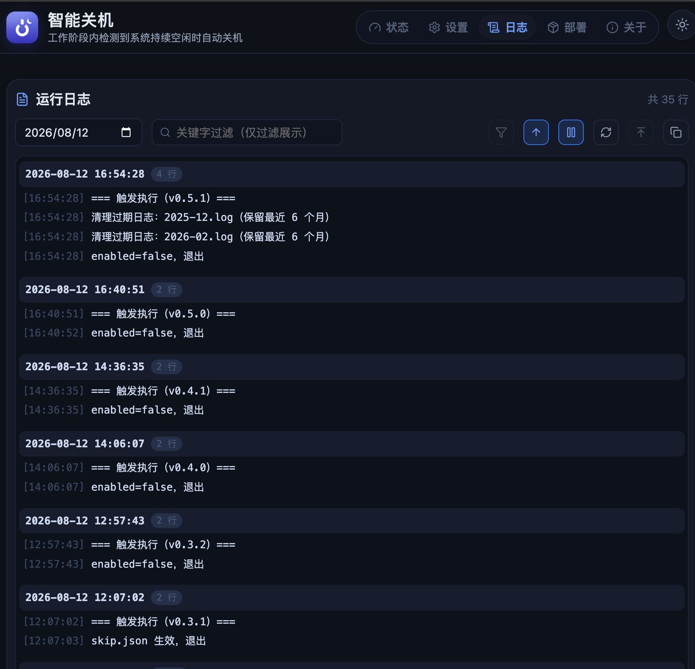

# 【飞牛 fnOS 应用推荐】智能关机：让 NAS 按空闲状态自动休息，配合智能插座实现低功耗运行

家里的 NAS 经常遇到这样的场景：晚上没人使用，但下载、同步、影音服务并没有真正产生有效工作；一直开机耗电，手动关机又容易忘记。更麻烦的是，第二天还想远程访问 NAS，关机后又需要手动开机。

「智能关机（fnos-app-shutdown）」就是为这个场景设计的 fnOS Native 应用：在设定的工作阶段内持续检查 NAS 是否真的空闲，所有启用的检查项都通过后，调用系统的正常关机流程。它不强制拔电、不直接切断电源，重点是把“什么时候可以安全关机”交给可配置的规则。



*状态页：查看当前工作阶段、执行器状态、今晚计划和最近一次检测结果。*

## 推荐组合：应用 + 智能插座 + BIOS 来电自启

完整的低功耗方案可以这样工作：

1. 智能插座按计划给 NAS 上电。
2. BIOS/UEFI 开启“Restore on AC Power Loss / 来电自启”，NAS 通电后自动启动。
3. fnOS 启动后，智能关机应用在工作阶段内检查 CPU、负载、用户、SSH、网络、下载连接、虚拟机、进程、主机在线等状态。
4. 连续满足关机条件后，应用让 NAS 优雅关机，系统先停止服务并卸载文件系统。
5. 智能插座在确认 NAS 已经关机后再断电，等待下一次计划上电。

这样可以把 NAS 的运行时间集中在真正需要的时段，同时保留每天自动启动、自动休息的能力。

> 重要：智能插座只能在 NAS 已经完成正常关机后断电。不要在 NAS 运行期间直接断电，否则可能造成文件系统损坏、阵列异常或数据丢失。



*流程图：智能插座负责供电计划，BIOS 负责来电启动，应用负责判断何时安全关机。*

## 适合哪些人

- 家庭 NAS 夜间基本无人使用，但白天需要自动可用
- 希望降低硬盘、风扇和整机的无效运行时间
- 使用下载、影音、同步、虚拟机等服务，需要“有任务就不关机”
- 想结合智能插座和 BIOS 来电自启，做一个简单可靠的定时运行方案
- 不想依赖云端服务，希望规则和状态都保存在本机

## 主要功能

- 工作阶段：默认 `23:00–08:00`，可按自己的作息调整
- 逐项开关检查条件：CPU、负载、在线用户、SSH 会话、磁盘 IO、网络收发、最小运行时长、SMB 会话、TCP 会话、下载连接、虚拟机、进程、磁盘擦洗、主机在线、日历规则
- 手动检测：先查看当前哪些条件阻止关机，再决定是否调整规则
- 运行日志：按月份保存，并按每次执行分组，便于排查“为什么没有关机”
- 今晚跳过：临时保留 NAS 运行，不需要修改长期配置
- 部署状态：显示执行器是否已部署、版本是否一致、cron 是否持续心跳
- 支持任意存储卷：应用安装在 `/vol1`、`/vol2` 等卷时，部署命令会使用应用实际数据目录
- 明亮/暗黑主题，移动端设置时间使用原生时间选择器

## 使用流程

### 1. 先配置 BIOS/UEFI

进入 NAS 主板 BIOS/UEFI，找到类似以下名称的选项并启用：

- `Restore on AC Power Loss`
- `AC Power Recovery`
- `After Power Failure`
- `来电自启 / 断电恢复通电`

建议选择“通电后自动开机”。不同主板名称可能不同，具体以主板说明书为准。先用一次手动断电、重新上电测试 BIOS 设置是否生效。

### 2. 配置智能插座

设置智能插座的每日上电时间，并为断电时间预留足够缓冲。例如应用预计最晚 `02:00` 关机，可以把插座断电安排在 `02:15` 或更晚。

第一次使用时建议观察完整流程：确认 NAS 已在 fnOS 中显示关机、硬盘指示灯停止活动后，插座再断电。不要把插座的断电时间设置在应用可能完成关机之前。

### 3. 安装并配置应用

1. 在 fnOS 应用中心安装「智能关机」。
2. 进入「设置」，先关闭不确定的检查项，只启用自己确实需要的规则。
3. 设置工作阶段、检查间隔、最大检查轮次和各检查项阈值。
4. 如需要防止刚启动就关机，启用“最小运行时长”。
5. 如有下载任务、虚拟机、重要进程或局域网设备，启用对应检查项。



*设置页：工作阶段和检查项都可以独立调整，建议先少量启用，再逐项观察日志。*

### 4. 部署执行器

进入「部署」页，复制一键命令，通过 SSH 登录 NAS 后执行。部署命令会：

- 安装 root 执行器到 `/usr/local/sbin/`
- 创建每 10 分钟运行一次的 cron 任务
- 自动把应用实际数据目录写入 `FNOS_SHUTDOWN_DATA_DIR`
- 为系统 `ping` 设置 `CAP_NET_RAW`，使低权限应用用户可以执行主机在线检查

部署完成后，可以在「验证部署结果」中运行 dry-run。首次部署后等待 cron 触发，部署状态变为“正常”。



*部署页：复制一键命令并在 NAS SSH 中执行，命令会写入实际数据目录和 cron。*

### 5. 先观察，再交给智能插座自动运行

建议先运行一晚观察日志：

- 是否进入工作阶段
- 哪个检查项阻止了关机
- 是否有下载、SMB、SSH 或主机在线状态
- 关机前是否仍有阵列同步、磁盘擦洗或虚拟机任务

确认规则符合预期后，再启用智能插座的自动断电计划。



*日志页：按执行次数查看每一轮检查，适合确认“哪一项阻止了关机”。*

## 常见问题

### Q1：这个应用会不会直接拔掉 NAS 电源？

不会。应用执行的是系统正常关机流程，目标是让 fnOS 完成服务停止和文件系统卸载。智能插座只负责计划上电和在确认关机后断电，两者职责分开。

### Q2：为什么需要 BIOS 来电自启？

应用只能负责“什么时候关机”，不能在断电后自行开机。BIOS 来电自启负责下一次通电启动，智能插座负责按计划提供电源，三者组合后才能形成“自动开机 → 空闲关机 → 下次自动开机”的循环。

### Q3：启用“主机在线”后提示 `ping 执行错误（rc=2）` 怎么办？

在「部署」页重新复制并执行一键部署命令。命令会对系统 ping 设置：

```bash
sudo setcap cap_net_raw+ep "$(command -v ping)"
```

然后使用 `fnos-app-shutdown` 用户 ping 本机验证。不要只手动运行 executor，也不要只修改应用配置；这个权限需要管理员通过 sudo 部署。

### Q4：提示 `未找到 setcap` 怎么办？

有些系统的普通用户 `PATH` 不包含 `/usr/sbin`，手动执行 `command -v setcap` 可能误报。优先直接重新执行部署命令，因为授权动作本身通过 `sudo setcap` 执行。

如果系统确实没有该命令，再按 fnOS/Debian 系统的软件包管理方式安装提供 `setcap` 的 libcap 工具，然后重新执行完整部署命令。

### Q5：SMB 检查提示 `smbstatus --processes 执行失败` 是故障吗？

执行器由 root 通过 cron 运行，正常部署后 SMB 检查应由 root 执行。若只是普通用户手动运行 `smbstatus --processes`，出现权限错误属于预期现象。请查看应用里的执行器日志或使用部署页的 dry-run，不要用普通用户结果判断 cron 是否正常。

### Q6：应用安装在 `/vol2`，部署状态一直不正常怎么办？

不要手动把数据目录改成 `/vol1`。重新打开应用「部署」页，等待 About 信息加载完成，确认命令中的 `DATA_DIR` 是实际安装卷，例如：

```bash
DATA_DIR='/vol2/@appdata/fnos-app-shutdown/data'
```

命令会把该目录写入 cron。执行器只使用 `FNOS_SHUTDOWN_DATA_DIR`，不会猜测 `/vol1` 或 `/var/apps`。

### Q7：为什么刚开机后没有马上关机？

检查“最小运行时长”、工作阶段时间和当前启用的检查项。应用默认采用安全策略：检查失败、命令不可用、状态异常时都按“不允许关机”处理，不会因为一次检测错误误关机。

### Q8：怎样临时阻止今晚关机？

在状态页使用“今晚跳过”。它只影响当前工作阶段，不会改变长期配置。第二天如需恢复自动关机，不需要重新部署。

### Q9：升级应用后需要重新部署吗？

正常升级后，执行器会在 cron 触发时通过签名校验自动同步新版。只有旧版本的部署命令没有写入实际数据目录，或需要补充 `ping` 权限时，才需要进入「部署」页重新执行一键命令。

### Q10：如何确认它真的安全？

先不要接入智能插座自动断电。连续观察几晚日志，确认应用只在所有条件通过时发起正常关机；同时为插座断电设置充足延迟。任何涉及阵列重建、磁盘擦洗、虚拟机、备份或大量文件传输的 NAS，都应优先启用对应检查项并进行实际验证。

## 使用建议

- 智能插座断电时间至少比预计关机时间晚 10–20 分钟，重要数据场景可留更长缓冲
- 初次部署先关闭“主机在线”和 SMB 等高级检查，确认基础流程正常后再逐项启用
- 不要把“能 ping 通”当成唯一的关机依据，下载、SMB、虚拟机、进程和磁盘任务也要结合实际启用
- 关机规则应以“宁可晚关机，也不要误关机”为原则
- 对重要 NAS 做好备份，智能插座和自动关机都不替代备份

## 反馈与交流

QQ 群：`657153308`


欢迎反馈你的 NAS 型号、fnOS 版本、智能插座方案和日志现象，也欢迎分享稳定运行后的配置经验。

项目地址：<https://github.com/timor-m/fnos-app-shutdown>
